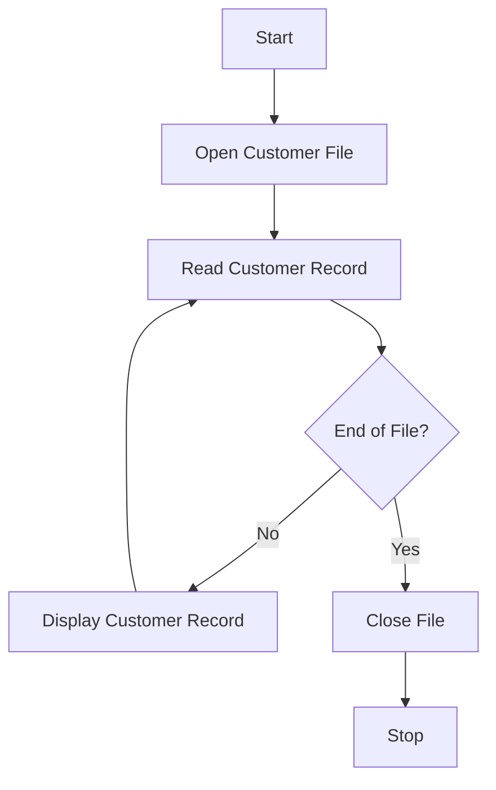

# Customer Report System Documentation

## Overview
This COBOL program processes customer records and generates a report of customer balances.

## Program Flow

## Code Structure

### Identification Division
- Program Name: CUSTOMER-REPORT

### Environment Division
- File Control: CUSTOMER-FILE (line sequential organization)

### Data Division
- Customer Record Structure:
  - Customer ID (5 digits)
  - Customer Name (30 characters)
  - Customer Balance (7 digits + 2 decimal places)

### Procedure Division
1. Opens the customer file
2. Reads records until end of file
3. Displays each customer record
4. Closes file and terminates

## Integration Notes
- File location: CUSTOMER.DAT must be in the program's working directory
- File format: Line sequential, fixed-length records
- Error handling: Basic end-of-file detection implemented

## Development Guidelines
1. Maintain consistent indentation in COBOL code
2. Update flowchart when modifying program logic
3. Test with sample data before production use

## GitHub Integration Features
- Use GitHub Actions for COBOL compilation testing
- Leverage GitHub Pages for documentation hosting
- Utilize GitHub Issues for tracking enhancements
- Enable GitHub Discussions for community feedback

## AI Generated Prompts
- Generate a detailed explanation for the IDENTIFICATION Division of the COBOL program.

       PROGRAM-ID. CUSTOMER-REPORT.
       

- Generate a detailed explanation for the ENVIRONMENT Division of the COBOL program.

       INPUT-OUTPUT SECTION.
       FILE-CONTROL.
           SELECT CUSTOMER-FILE ASSIGN TO 'CUSTOMER.DAT'
           ORGANIZATION IS LINE SEQUENTIAL.
           

- Generate a detailed explanation for the DATA Division of the COBOL program.

       FILE SECTION.
       FD CUSTOMER-FILE.
       01 CUSTOMER-RECORD.
           05 CUSTOMER-ID       PIC 9(5).
           05 CUSTOMER-NAME     PIC X(30).
           05 CUSTOMER-BALANCE  PIC 9(7)V99.
           

- Generate a detailed explanation for the PROCEDURE Division of the COBOL program.

           OPEN INPUT CUSTOMER-FILE
           READ CUSTOMER-FILE
               AT END SET END-OF-FILE TO TRUE
           END-READ
           PERFORM UNTIL END-OF-FILE
               DISPLAY CUSTOMER-RECORD
               READ CUSTOMER-FILE
                   AT END SET END-OF-FILE TO TRUE
               END-READ
           END-PERFORM
           CLOSE CUSTOMER-FILE
           STOP RUN.

